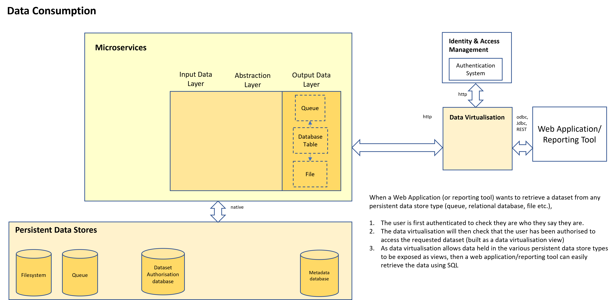

# Dataset Consumption
By using a data virtualisation component in the reference architecture, data consumption becomes a lot easier.
The data virtualisation layer provides wrappers for a variety of persistent data store types (queues, files, data lakes, relational dataabases etc.) and the datasets then effectively operate in the same way as SQL views with grant permissions against these views controlling access to the underlying datasets.

