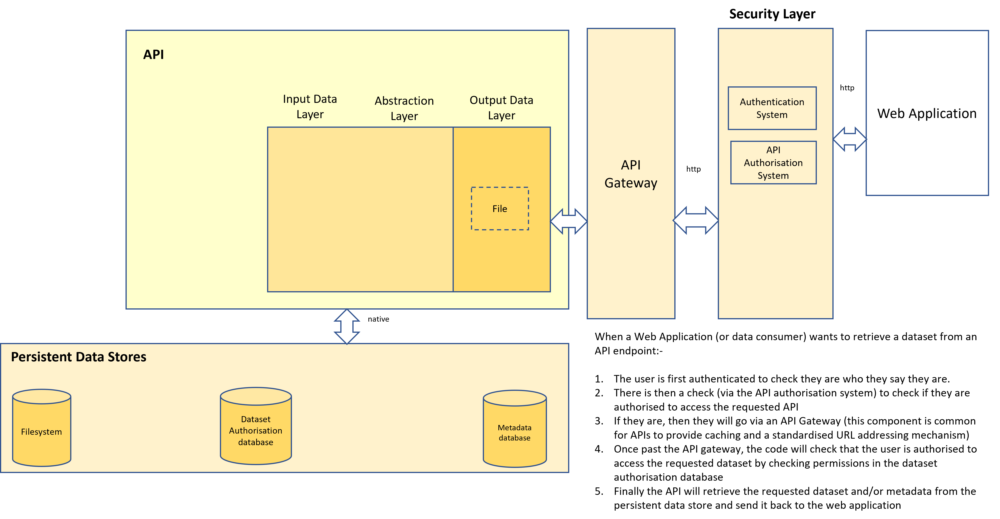

# Dataset Consumption
Slightly different consumption patterns will exist dependent on the manner in which the data consumer wants to be able to access a data product dataset.
The options are via
* An API endpoint
* From a relational database
* From a queue

#### Dataset consumption via an API endpoint
The diagram below explains how it's envisaged that a dataset can be retrieved from an API endpoint

#### Dataset consumption from a relational database
The diagram below shows an alternative path by which the user can retrieve a dataset by directly fetching it from the dataset database

