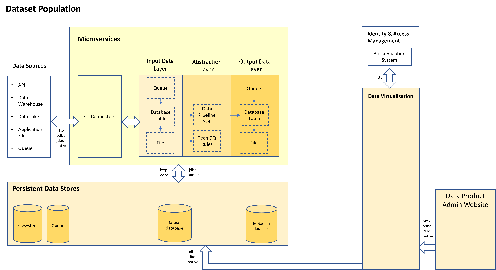

# Dataset Population

When a data product container is first started and/or when the data product admin website requests that a data pipeline be executed then the following occurs:-

1. Code ensures that Source datasets are fetched from the data sources and landed into the src_data schema in the dataset database
2. Code executes the pipeline.sql script which uses sql to transform the data into an abstracted form and then populates a target dataset table in the target_data schema in the dataset database. The pipeline.sql script also controls dataset versioning
3. Code runs to extract the target dataset data from the dataset database and save it in CSV and JSON files

Additionally, the data product team can upload a datadictionary (schema.csv) file into the metadata database which fully describes the target dataset.

