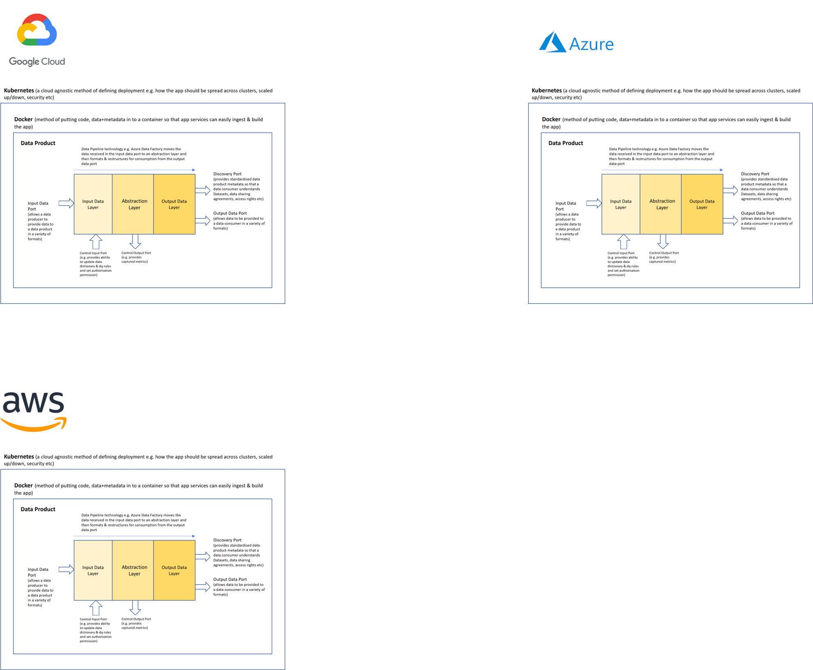

# High Level Data Product Architecture

Zhamak's data mesh book provides more of an architectural vision than information that would allow an IT solution architecture team to practically build out Data Products in a Data Mesh.

Some information can be gleaned as to what is anticipated, however, from the information in the book and subsequent presentations.

The data product system architecture has to meet the following:-

1. Be self-contained
2. Have standardised interfaces so that  
3. Be well documented (e.g. provide info and/or links to name, version, data sharing agreements, data lineage diagrams, data models (diagram and data dictionary) etc )
4. Be discoverable - both by human beings (via a data marketplace) and by machines who should be able to query metadata via a data product discovery port/endpoint
5. Be secure (i.e. authentication (human and machine) and authorisation (to the data product and to the underlying datasets))
6. Be able to source data in a variety of formats and be able to make available for consumption data in a variety of formats
7. Be able to be deployed to more than 1 platform
8. Be able to cope with batch, stream and request-response data flows

As Zhamak has come from an API/microservices background the easiest architecture to implement initially is 1 focused on request-response data flows using a REST APIs.

In the picture above:- 
1. The ports can be built out as REST API endpoints. 
2. The data pipeline that moves data between the layers can just be executed as sql statements (similar to dbt concept) fired externally via the control input port
3. Each layer will hold data in a relational database. The input data layer and output data layer should be able to store the data in a variety of formats e.g. csv, json, parquet etc.
4. The metadata that can be retrieved via the discovery port can similarly be held in a relational database
5. If fine grained authorisation is required then a security database can also be within the data product that specifies permissions for particular datasets delivered by the data product.
6. The data product is code+data/metadata. To ensure consistent builds on multiple cloud platforms it can be containerised using Docker
7. Similarly to ensure consistent deployment to cloud infrastructure, kubernetes can be specified.

By containerising data products using Docker & Kubernetes, data products can be cloud-agnostic

By defining standardised interfaces, data products can be interoperable. For example, we could have a continents data product and a countries data product feeding a geography data product. This allows for increasingly complex data products to be created

