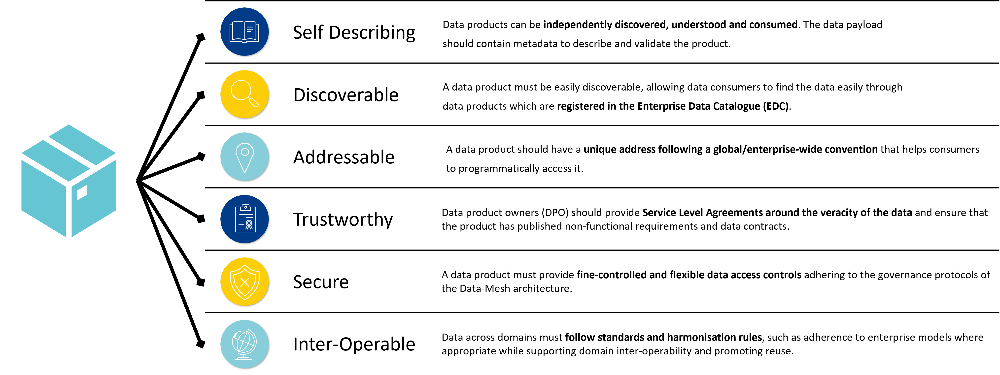
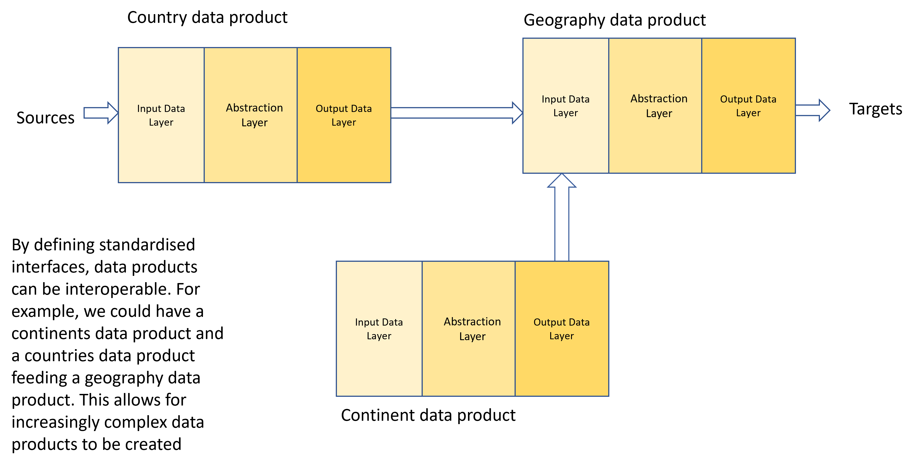
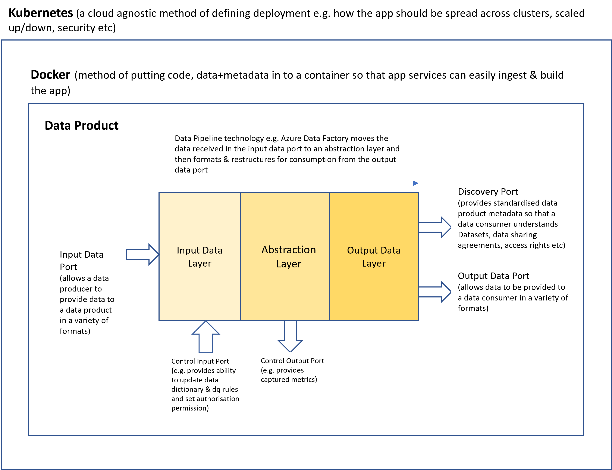
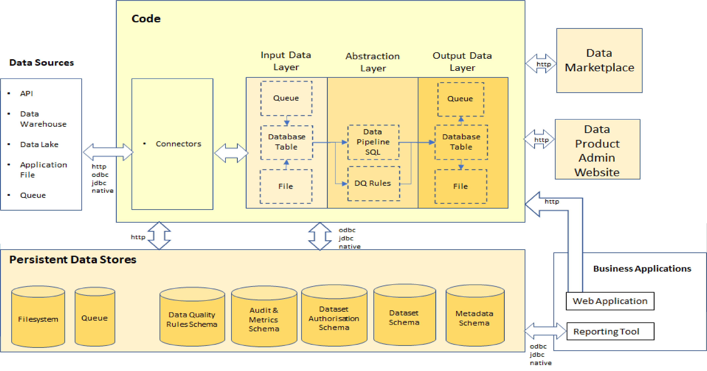
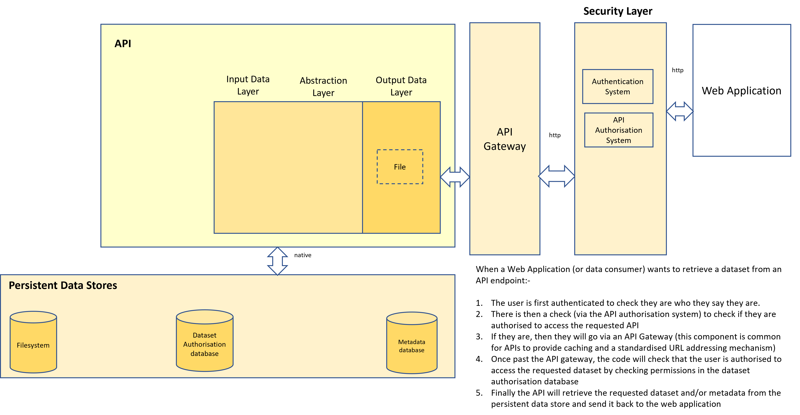
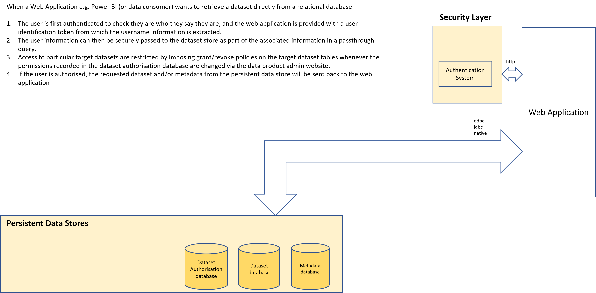
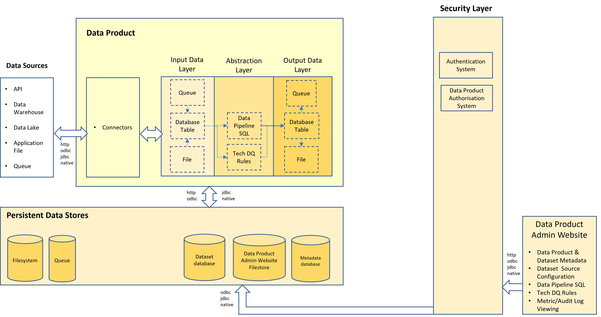

# High Level Data Product Architecture

Zhamak's data mesh book provides more of an architectural vision than information that would allow an IT solution architecture team to practically build out Data Products in a Data Mesh.

Some information can be gleaned as to what is anticipated, however, from the information in the book and subsequent presentations.

## Architectural Requirements

The data product system architecture has to have the following architectural features:-

### Self Describing 
Each data product will maintain it's own documentation within a relational database. This will be available via the discovery port.

### Discoverable
Data products will be discoverable via a [data marketplace](data-marketplace.md). Additionally, the metadata (information about the data product) will be programatically available via the discovery port allowing crawler apps to automatically discover data products.

### Addressable
Data products will be provided with standardised addresses via a Gateway.

## Trustworthy
Data products can be trusted by ensuring that:-
* Documentation shows how the data was sourced and cleansed
* It is secure
* It is well documented

## Secure
As described in [authentication and authorisation](dp-authentication.md), data products can be secured using an organisation's authentication system and authorisation system by linking a data product gateway to those security systems.

## Inter-Operable
By defining standardised interfaces, data products can be interoperable. 
For example, we could have different country sales data products aggregated up to a continental sales data product  feeding a 
global sales data product. This allows for increasingly complex data products to be created

## High Level Architecture diagram

## Detailed Architecture diagram

The diagram shows a more detailed view as to how data products in general work and covers both data product creation and data product consumption.
Further sections below will split this out and focus on different ways that you can consume datasets

The data product will have the following capabilities:-
1. Can pull data (via connectors) from:-
   * Files on cloud storage
   * Relational Database sources e.g. Azure Synapse
   * Data Lake SQL endpoints e.g. Databricks SQL Warehouse
   * File Storage
   * Datasets provided by other APIs
2. Can have data pushed (via connectors) by Applications into:-
   * Files
   * A Relational database table
   * A Queue/Steam
3. Can pull data into Files, a Relational Table or a Queue/Stream from:- 
   * SQL Endpoints
   * File Storage
   * Other APIs
   * Relational database sources
4. Can import the data captured in the Input Data Layer into Relational Database Tables 
5. Will allow data pipeline sql to be securely injected and executed which will move data from the input connectors to the output data layer for consumption by the web application.
6. Can provide the data to data consumers as either:-
   * Files
   * Queues
7. Will be performance managed by a Data Product gateway
8. Will record it's metadata in a relational database that can feed an enterprise data catalogue.
9. Can be administered and configured via a Data Product Admin website which will allow the following to be defined and sent to the relevant data product component:-
   * Data Product metadata
   * Technical data quality rules
   * Dataset source and storage in the persistent data store
   * Data pipeline SQL which will move source datasets to target datasets
10. Will have it's metadata:-
   * Published on a data marketplace (useful for business users)
   * Made available from a discovery port/endpoint (useful for developers)
   * Made available by querying the metadata database directly (useful for data analysts)

### Data Product & Dataset Creation

The diagram below explains how it's envisaged that Data Products & Datasets can be created

### Dataset Consumption
Slightly different consumption patterns will exist dependent on the manner in which the data consumer wants to be able to access a data product dataset.
The options are via
* An API endpoint
* From a relational database
* From a queue

#### Dataset consumption via an API endpoint
The diagram below explains how it's envisaged that a dataset can be retrieved from an API endpoint

#### Dataset consumption from a relational database
The diagram below shows an alternative path by which the user can retrieve a dataset by directly fetching it from the dataset database

### Dataset Population

When a data product container is first started and/or when the data product admin website requests that a data pipeline be executed then the following occurs:-

1. Code ensures that Source datasets are fetched from the data sources and landed into the src_data schema in the dataset database
2. Code executes the pipeline.sql script which uses sql to transform the data into an abstracted form and then populates a target dataset table in the target_data schema in the dataset database. The pipeline.sql script also controls dataset versioning
3. Code runs to extract the target dataset data from the dataset database and save it in CSV and JSON files

Additionally, the data product team can upload a datadictionary (schema.csv) file into the metadata database which fully describes the target dataset.

