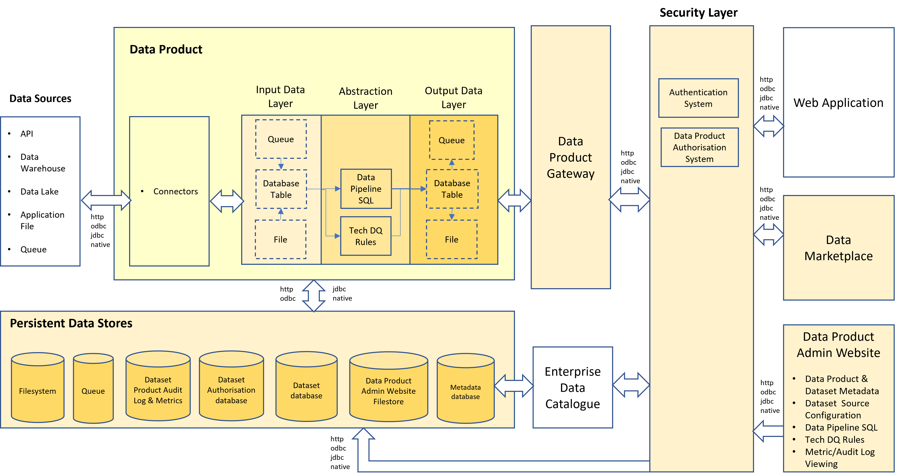

# High Level Data Product Architecture

Zhamak's data mesh book provides more of an architectural vision than information that would allow an IT solution architecture team to practically build out Data Products in a Data Mesh.

Some information can be gleaned as to what is anticipated, however, from the information in the book and subsequent presentations.

## Architectural Requirements

The data product system architecture has to have the following architectural features:-

### Self Describing 
Each data product will maintain it's own documentation within a relational database. This will be available via the discovery port.

### Discoverable
Data products will be discoverable via a [data marketplace](data-marketplace.md). Additionally, the metadata (information about the data product) will be programatically available via the discovery port allowing crawler apps to automatically discover data products.

### Addressable
Data products will be provided with standardised addresses via a Gateway.

## Trustworthy
Data products can be trusted by ensuring that:-
* Documentation shows how the data was sourced and cleansed
* It is secure
* It is well documented

## Secure
As described in [authentication and authorisation](dp-authentication.md), data products can be secured using an organisation's authentication system and authorisation system by linking a data product gateway to those security systems.

## Inter-Operable
By defining standardised interfaces, data products can be interoperable. 
For example, we could have different country sales data products aggregated up to a continental sales data product  feeding a 
global sales data product. This allows for increasingly complex data products to be created

## High Level Architecture diagram

## Detailed Architecture diagram

The data product will have the following capabilities:-
1. Can pull data (via connectors) from:-
   * Files on cloud storage
   * Databricks SQL Warehouse (aka SQL endpoints)
   * Files in Data Lakes
   * Datasets provided by other APIs
2. Can have data pushed (via connectors) by:-
   * Applications into Files and/or a Relational database table
   * Applications into Queues/Streams
3. Will be performance managed by an API gateway
4. The Data Product gateway will:-
   * Communicate with authentication and authorisation systems to only allow authorised systems & users to access a particular endpoint
   * Standardise URL addressing
5. Will record it's metadata in a relational database that can feed an enterprise data catalogue.
6. Will be published on a data marketplace
7. Will allow data pipeline sql to be securely injected and executed which will move data from the input connectors to the output data layer for consumption by the web application.
8. Will have an endpoint that allows metadata and documentation to be retrieved programatically.

