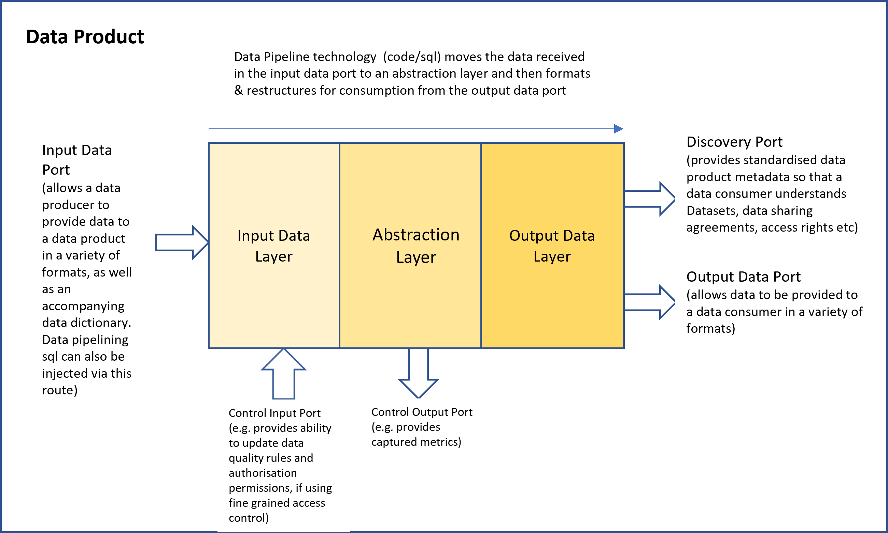

# High Level Data Product Architecture

Zhamak's data mesh book provides more of an architectural vision than information that would allow an IT solution architecture team to practically build out Data Products in a Data Mesh.

Some information can be gleaned as to what is anticipated, however, from the information in the book and subsequent presentations.

## Architectural Requirements

The data product system architecture has to have the following architectural features:-

### Self Describing 
Each data product will maintain it's own documentation within a relational database. This will be available via the discovery port.

### Discoverable
Data products will be discoverable via a [data marketplace](data-marketplace.md). Additionally, the metadata (information about the data product) will be programatically available via the discovery port allowing crawler apps to automatically discover data products.

### Addressable
Data products will be provided with standardised addresses via a Gateway.

## Trustworthy
Data products can be trusted by ensuring that:-
* Documentation shows how the data was sourced and cleansed
* It is secure
* It is well documented

## Secure

As described in [authentication and authorisation](dp-authentication.md), data products can be secured using an organisation's authentication system and authorisation system by linking a data product gateway to those security systems.

## Inter-Operable
By defining standardised interfaces, data products can be interoperable. 
For example, we could have different country sales data products aggregated up to a continental sales data product  feeding a 
global sales data product. This allows for increasingly complex data products to be created

Additionally by placing data products within build and deploy containers we can ensure that they can be placed on any cloud platform which has potential cost benefits in not be tied to a single vendor.

## High Level Architecture diagram

## Detailed Architecture diagram

The data product will have the following capabilities:-
1. Can pull data (via connectors) from:-
   * Files on cloud storage
   * Database endpoints
   * Files in Data Lakes
2. Can have data pushed (via connectors) to it by:-
   * Files (by applications)
   * Messages (by queues/streams)
3. Will be performance managed by an API gateway
4. The API gateway will communicate with authentication and authorisation systems to only allow authorised systems & users to access a particular endpoint
5. Will record it's metadata in a relational database that can feed an enterprise data catalogue.
6. Will be published on a data marketplace
7. Will allow data pipeline sql to be securely injected and executed which will move data from the input connectors to the output data layer for consumption by the web application.
8. Will have an endpoint that allows metadata and documentation to be retrieved programatically.

## Proof of Concept Notes
As Zhamak has come from an API/microservices background the easiest architecture to implement initially is 1 focused on request-response data flows using a REST APIs.

For the [PoC](dp-tands-poc.md) In the picture above:- 
1. The ports can be built out as REST API endpoints. 
2. The data pipeline that moves data between the layers can just be executed as sql statements (similar to dbt concept) fired externally via the control input port
3. Each layer will hold data in a relational database. The input data layer and output data layer should be able to store the data in a variety of formats e.g. csv, json, parquet etc.
4. The metadata that can be retrieved via the discovery port can similarly be held in a relational database
5. If fine grained authorisation is required then a security database can also be within the data product that specifies permissions for particular datasets delivered by the data product.
6. The data product is code+data/metadata. To ensure consistent builds on multiple cloud platforms it can be containerised using Docker
7. Similarly to ensure consistent deployment to cloud infrastructure, kubernetes can be specified.

