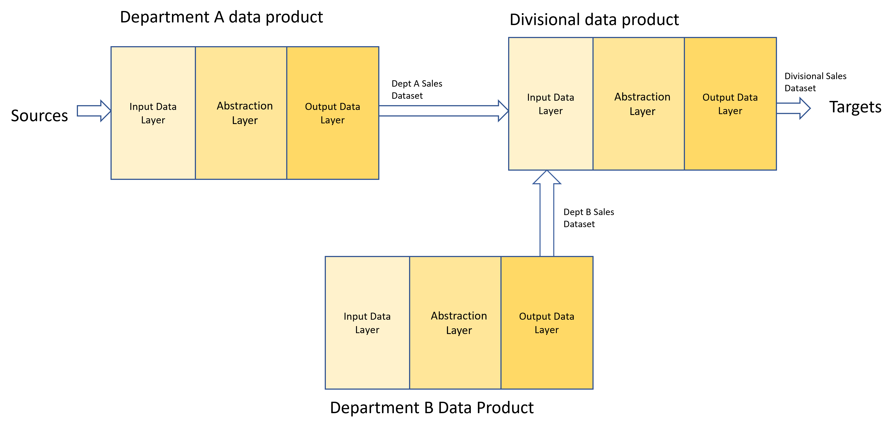

# High Level Data Product Architecture

Zhamak's data mesh book provides more of an architectural vision than information that would allow an IT solution architecture team to practically build out Data Products in a Data Mesh.

Some information can be gleaned as to what is anticipated, however, from the information in the book and subsequent presentations.

## Architectural Requirements

The data product system architecture has to have the following architectural features:-


### Self Describing 
Each data product will maintain it's own documentation within a relational database. This will be available via the discovery port.

### Discoverable
Data products will be discoverable via a [data marketplace](data-marketplace.md). Additionally, the metadata (information about the data product) will be made available via:-
   * the discovery port which will speed up web application development 
   * In a metadata database. This can be queried and metadata transferred into the enterprise data catalog. Either the metadata database or the enterprise data catalog can then provide the metadata to a data marketplace which users will use to search for data products.

### Addressable
Data products will be provided with standardised addresses e.g
```
https://data-products.acme.com/global/0.1/sales/0.1
https://data-products.acme.com/global/divisionA/0.1/sales/0.1
https://data-products.acme.com/global/divisionA/departmentA/0.1/sales/0.1
https://data-products.acme.com/global/divisionA/departmentB/0.1/sales/0.1
```
By providing standardised addresses, it makes it quicker to get at datasets. And transforms data products into a world wide web of data.

## Trustworthy
Data products can be trusted by ensuring that:-
* Documentation shows how the data was sourced and cleansed
* It is secure
* It is well documented

## Secure
As described in [authentication and authorisation](dp-authentication.md), data products can be secured using an organisation's user authentication system coupled with data product and dataset authorisation systems.

## Inter-Operable
By defining standardised interfaces, data products can be interoperable. 
For example, we could have department A configure a data product to provide its sales data as a dataset. Department B could likewise create a data product serving up it's sales dataset. 
A division could then create a data product that aggregates up the sales datasets from department A and B. And then different divisional data products sales datasets can be consumed by an organisational data product.
This ability to mix and match data products by providing standardised interfaces means that increasingly complex data products can be created from basic building blocks.


## High Level Architecture diagram


## Detailed Architecture diagram

The diagram shows a more detailed view as to how data products in general work and covers both data product creation and data product consumption.
Further sections below will split this out and focus on different ways that you can consume datasets


The data product will have the following capabilities:-
1. Can pull data (via connectors) from:-
   * Files on cloud storage
   * Relational Database sources e.g. Azure Synapse
   * Data Lake SQL endpoints e.g. Databricks SQL Warehouse
   * File Storage
   * Datasets provided by other APIs
2. Can have data pushed (via connectors) by Applications into:-
   * Files
   * A Relational database table
   * A Queue/Stream
3. Can pull data into Files, a Relational Table or a Queue/Stream from:- 
   * SQL Endpoints
   * File Storage
   * Other APIs
   * Relational database sources
4. Can import source dataset files captured in the Input Data Layer into Relational Database Tables 
5. Will allow data pipeline sql to be securely injected and executed which will move data from the input connectors to the output data layer for consumption by the web application.
6. Can provide the data to data consumers as either:-
   * Files
   * Queues
7. Will be performance managed by a Data Product gateway
8. Will record it's metadata in a relational database that can feed an enterprise data catalogue.
9. Can be administered and configured via a Data Product Admin website which will allow the following to be defined and sent to the relevant data product component:-
   * Data Product metadata
   * Technical data quality rules
   * Dataset source and storage in the persistent data store
   * Data pipeline SQL which will move source datasets to target datasets
10. Will have it's metadata:-
   * Published on a data marketplace (useful for business users)
   * Made available from a discovery port/endpoint (useful for developers)
   * Made available by querying the metadata database directly (useful for data analysts)

To provide more focus as to how data product functionality works in practice, 
further architecture diagrams are provided that focus on the following aspects of the architecture:-
* [Data Product & Dataset Creation](data-product-and-dataset-creation.md)
* [Dataset Consumption](dataset-consumption.md)
* [Dataset Population](dataset-population.md)
* [Data Product Authentication and Authorisation](dp-authentication.md)


