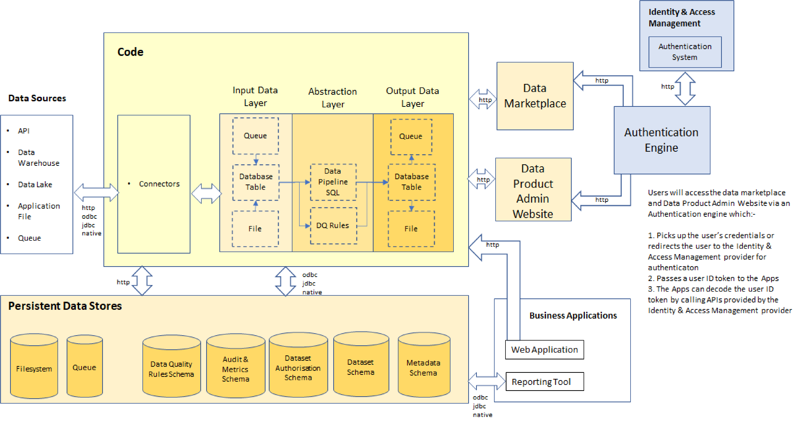

# Authentication & Authorisation

Apart from public data, most organisation's data needs to be secured. 

In terms of a data product, security will need to cover authentication and authorisation of a user.

This particular topic is one of the hardest parts of implementing a data product as each organisation has their 
own established ways of authenticating and authorising users/systems which in my experience can take weeks to establish.
## Authentication
Authentication means ensuring that a user is who they say they are. There are many methods of authenticating a user. 
These include:-
### Basic Authentication
This is a simple username and password which are typically combined, base-64 encrypted and passed to a data product in the header of a http request.
This type of authentication is the easiest to implement but also the least secure. 

### Multi-factor authentication
Takes authentication to the next level by requiring a user/system to authenticate by more than 1 method 
e.g. 
1. the user is asked to type their username and password in a web browser
2. The user is also required to confirm their identity typically by:-
   * Sending a text or email which the user either has to click a link or copy a one-time password in to the web page
   * Using an identity provider app to confirm their identity. When done, they are returned to the original website
   * Being redirected to an identity provider website to confirm their identity. When done, they are returned to the original website
   Common examples of trusted identity providers include:-
   * PingID
   * Microsoft
   * Google
   * Facebook
   * Linkein

## Token based authentication
   This typically involves a set of flows between an authentication system and server application which involves 
   * the server application providing information that was previously registered with the authentication system
   * the authentication system responding to a server application url which was previously registered.
   * the server application redirecting the user to the authentication system to securely authenticate
   * the authentication system responding with an access token to a callback url on the server application
   * the server application can subsequently use the access token (which periodically typically needs to be refreshed) to authenticate as the user

## Authorisation
Authorisation means ensuring that an authenticated user is permitted to access the requested data. 
For a REST API, authorisation can be confined to ensuring that a user/role is entitled to access a particular endpoint 
or more fine grained authorisation can be provided which ensures only certain datasets or even dataset fields are provided.

# Implementing Authentication & Authorisation within an Organisation

Organisations should implement a mechanism by which access to data products is provided via a gateway where requests can be authenticated using an organisations's preferred authentication method and permissions to access the endpoint

By using a gateway, it provides a central point by which authentication and authorisation can occur. This makes it much easier to audit and removes the reliance on data product development teams implementing enterprise security correctly.
