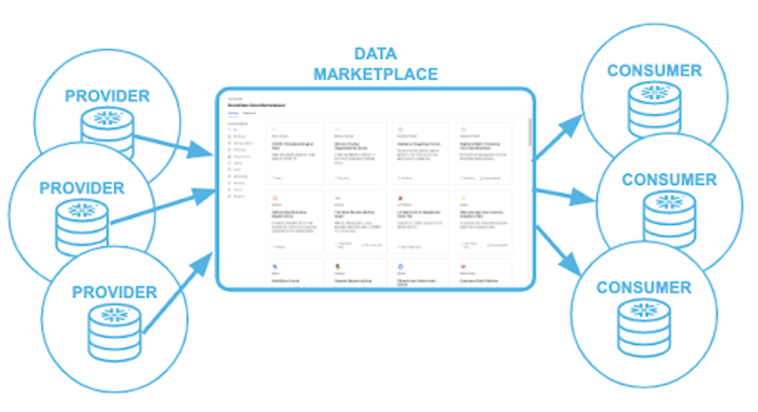
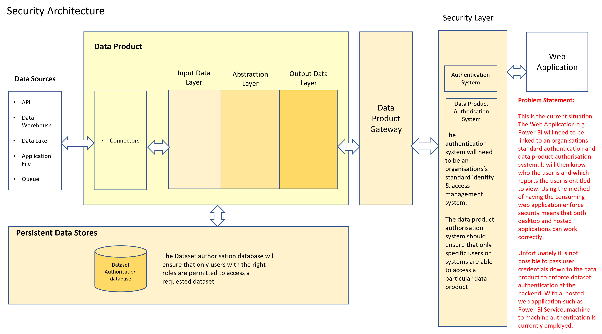
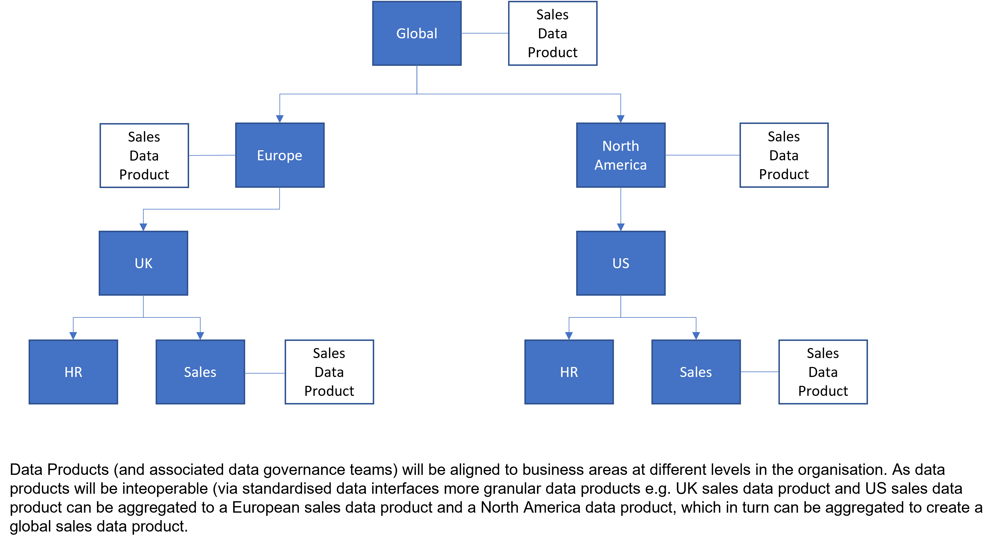

# What is special about data products?

Up until now it has been difficult for business people within organisations to feel engaged with 
* improving the data quality
* maintaining data dictionaries

which is critical to the success of an organisation. 

Typically IT is tasked with creating analytical data stores (operational data stores, data lakes, data warehouses, data marts) which support reports & executive dashboards.

Problems occur throughout the process, as business people often simply provide a high level set of requirements or, if asked to be more engaged, have no real feel for how they can improve data without being able to see it.

When the analytical data store is finally built, its not often well documented or might be in IT language so the business doesn't understand what the data set contains.
Other problems occur in that it's typically difficult to know the provenance of the data set or how good the quality of the data is.

In the past to sort out these issues, data governance programs have been initiated but data governance tools often don't allow the business to see the data that they're being asked to govern.

Finally, it's also typically difficult to know where data sets are and how to access them. 

# Data Products
So data products are stepping in to solve this problem. 

They will provide the following key benefits to an organisation:-

* A [data marketplace](data-marketplace.md) - which will allow a user to search for data products by business function.

* A data product admin website will allow business areas (and their data analysts) to securely configure:-
   * [Data product metadata](dp-docs_and_metadata.md)
   * Where to source data from e.g the data lake, a filestore, a relational database etc.
   * Technical data quality rules
   * Source to target transformation written in SQL

   They will also be able to view data product metrics and audit logs.

* [Documentation](dp-docs_and_metadata.md) - each data product will contain (or provide links to) documentation which allows the user to fully understand:-
   * What the data product can provide
   * Where it came from
   * How good the data quality (DQ) is and the DQ rules have been implemented
   * How often it is updated
   * Contact Information
   * How to get access to the data
   * Service Level Agreements

* Improved [security](dp-authentication.md) - access to data products will be via an organisation's preferred authentication & authorisation systems. This ensures that data sets (delivered by the data products) are only made available to authorised workers. 
Additionally, audit logs will be kept within each data product to track who has been accessing which dataset and when.

* Better trusted - data product [documentation](dp-docs_and_metadata.md) will identify:-
   * Where data has come from (via data lineage diagrams)
   * When it was updated
   * What [data quality rules](dp-data-quality.md) have been applied

   
* Better alignment with the business - As business users will be able to search for data products grouped by their functional area, 
they will be able to be able to read the documentation and examine the data product data for themselves. 
This will help to easily identify problems with the data both within their business area and across business areas for data that needs to be reported on 
at a higher level. 
For example, an UK sales team might observe that in their sales dataset delivered from their data product, amounts are stored in £ and convertible to $ and €, whereas the US team's sales dataset (delivered by their data product) only has the currency in $. 
They could then work with their US colleagues on coming up with a common sales dataset standard that would work for both teams.

* Able to source and provide data in a variety of format - For example:-
   * Most business users would most likely want to view data as CSV files so that they can use Excel
   * Web application developers typically want to deal with data in JSON file format.
   * Data scientists may want Parquet or ORC file formats due to their more efficient storage improving Big Data queries

* Interoperable - by providing standardised interfaces for data products, data products can be linked together like Lego bricks to provide more sophisticated solutions.
For example, the sales data product could deliver customer data sets. The customer dataset can then be used by the service department who create a service data product that provides customer_service dataset that links customers to their service records

