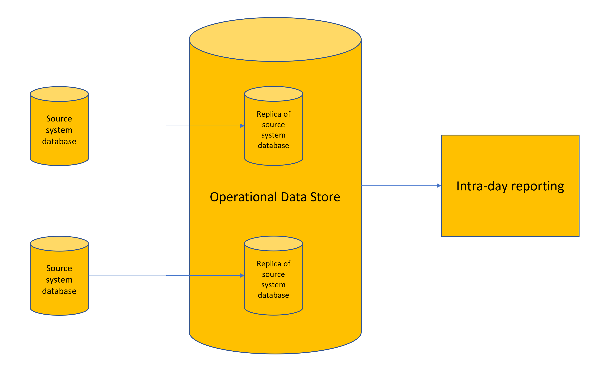
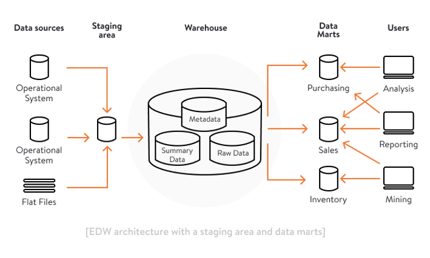
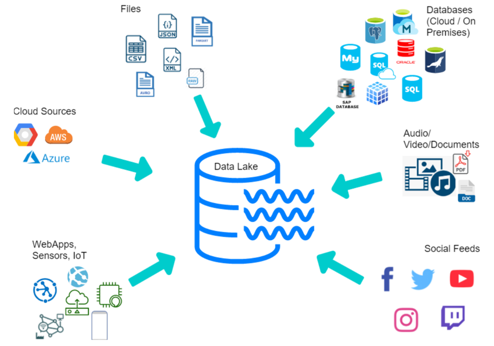

# What is special about data products?

For Analytics / Business Intelligence, the following are the main methods of storing data that will allow business users to be able to create/view analyticals information:-

## An operational data store (ODS)

This method effectively copies relational data at source with limited attempts to clean the data. 
It achieves this typically by capturing data from source logs and applying it to the ODS.
It's useful for running intraday reports or reacting to source data changes
It's main disadvantages are that:-
  1. The capture-apply replication method isn't very scalable so can only cope with relatively small data changes.
  2. It can only handle relational data

## An enterprise data warehouse (EDW)

This method was prevalent from 1990s through to 2000s. It involves:-
* Capturing relational data from source into a staging area
* Writing complex extract, transformation and load (ETL) scripts to push data into an enterprise data warehouse.

The problems with this approach are:-
1. Data warehouses are typically loaded as an overnight batch job so are not suitable for information that is updated intra-day
2. IT are in total control of the data that gets loaded into the data warehouse. Where the data is sourced from and how it is transformed is buried in the complex scripts
3. Knowing what data is available in the enterprise data warehouse is also often in the gift of IT
4. To create an enterprise data warehouse typically takes years and any requests to add or update it typically takes months.

## A data lake

By the late 2000s, it became apparent that analytics would need to be able to cope with much larger volumes of data, process the data more rapidly and be able to deal with more than just relational data. Fortuitously, data storage costs came down significantly around the same time.

Due to the identified ODS and EDW issues, organisations realised that they needed a better solution, so data lakes emerged. 
A data lake involves:-
* Operational systems writing data to the data lake as raw data files in a variety of formats
* Data pipelining scripts can then run to merge data from different files and clean it so that its of good enough quality for use in analytics.

A data lake avoids expensive updates of existing data, so can cope with much larger volumes of data and much more quickly than previously. For data scientists, they were also able to start writing scripts against the raw data captured in the data lake without waiting for IT to clean up the data. This gave a speed to market benefit.

The downsides of a data lake include:-
1. As the raw data is stored in a variety of formats, it originally required IT to be able to write code to extract analytics for business users. Later SQL interfaces partially circumvented this problem, however.
2. Physically stored raw data is typically not understandable to anybody who doesn't work in IT and isn't familiar with the source systems.
3. Curated data is still typically created by IT. Business areas might supply requirements but are reliant on IT to implement correctly.
4. Business users cannot easily get access to data in the data lake nor discover what data is in there. 
5. A monolithic data lake contains datasets from business areas throughout the organisation. So even if business users can access the monolithic data lake, its a case of not being able to see the wood for the trees. 
6. Raw data in the data lake is of poor quality and hence cannot be trusted.
7. Data security is often a problem with data lakes as it can be the case that a user who is given access to a data lake can see files that they should not be permitted to see.

# Data Products
So data products are stepping in to solve this problem. They will provide the following key benefits to an organisation:-

1. A [data marketplace](data-marketplace.md) - which will allow a user to search for data products by business function.

2. A data product admin website will allow business areas (and their data analysts) to securely configure:-
   * [Data product metadata](dp-docs_and_metadata.md)
   * Where to source data from e.g the data lake, a filestore, a relational database etc.
   * Technical data quality rules
   * Source to target transformation written in SQL

   They will also be able to view data product metrics and audit logs.

2. [Documentation](dp-docs_and_metadata.md) - each data product will contain (or provide links to) documentation which allows the user to fully understand:-
   * What the data product can provide
   * Where it came from
   * How good the data quality (DQ) is and the DQ rules have been implemented
   * How often it is updated
   * Contact Information
   * How to get access to the data
   * Service Level Agreements

3. Improved [security](dp-authentication.md) - access to data products will be via an organisation's preferred authentication & authorisation systems. This ensures that data sets (delivered by the data products) are only made available to authorised workers. 
Additionally, audit logs will be kept within each data product to track who has been accessing which dataset and when.

4. Better trusted - data product [documentation](dp-docs_and_metadata.md) will identify:-
   * Where data has come from (via data lineage diagrams)
   * When it was updated
   * What [data quality rules](dp-data-quality.md) have been applied
   
5. Better alignment with the business - As business users will be able to search for data products grouped by their functional area, 
they will be able to be able to read the documentation and examine the data product data for themselves. 
This will help to easily identify problems with the data both within their business area and across business areas for data that needs to be reported on 
at a higher level. 
For example, an UK sales team might observe that in their sales dataset delivered from their data product, amounts are stored in £ and convertible to $ and €, whereas the US team's sales dataset (delivered by their data product) only has the currency in $. 
They could then work with their US colleagues on coming up with a common sales dataset standard that would work for both teams.

7. More efficient - Enterprise data warehouses and data lakes end up as monoliths of data. This was similar to the situation that existed with application code up until 1990s. Application coders realised that the way to improve things was to split monolithic applications into microservices. Data products can follow the same path.
For example, in the case of an enterprise data warehouse, you typically join all of your sales data from multiple sales systems and store in a enterprise sales fact table which can be diced and sliced by a number of dimensional tables e.g. country. 
When you write a report, you might then filter on country. So your IT team has built a large sales table and your data consumers are then decomposing it when they query it.
However, in the case of a data product, you could create:-
   * A sales data product for each country
   * And then an aggregated sales data product for each continent/market
   * And finally a global sales data product. 
The user can then decide which level of data product they want to use in a particular report. This is much more efficient. 
7. Able to source and provide data in a variety of format - For example:-
   * Most business users would most likely want to view data as CSV files so that they can use Excel
   * Web application developers typically want to deal with data in JSON file format.
   * Data scientists may want Parquet or ORC file formats due to their more efficient storage improving Big Data queries
8. Interoperable - by providing standardised interfaces for data products, data products can be linked together like Lego bricks to provide more sophisticated solutions.

