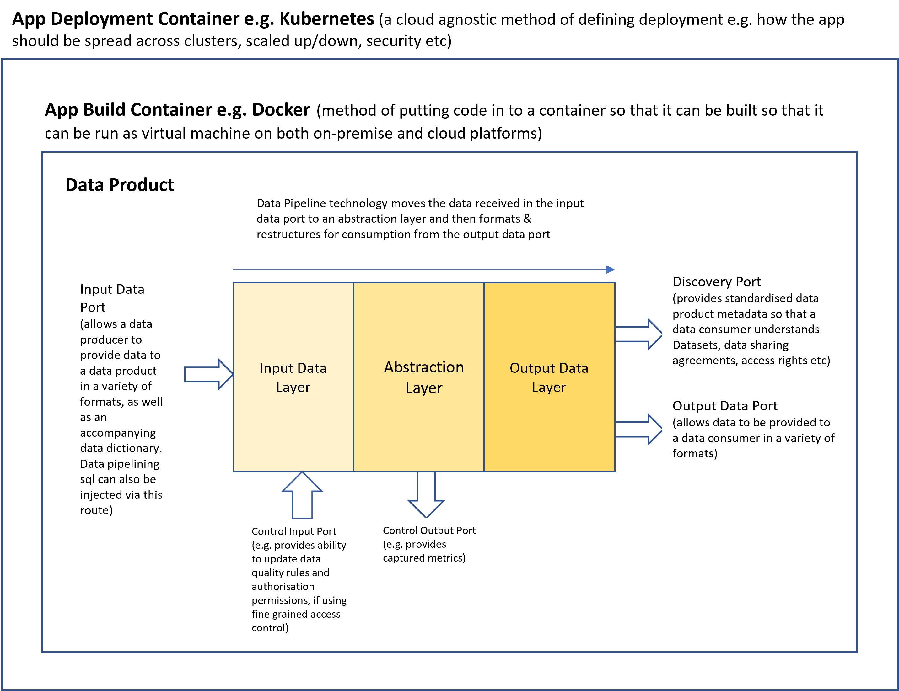

# Infrastructure

1 of the key new ideas in data mesh is that data products should be containerised and deployable to any node in the data mesh

# Containerisation

## Build containers
Docker is the best known technology to create a container which effectively runs like a virtual machine with all of the application code, data & ports configured to run within it. 
Docker is very mature and supported by all of the major cloud platforms. For on-prem servers or developers laptop, Docker Desktop installs the docker software. 
A build configuration is as simple as adding a Dockerfile with the config information to the root of the application project directory.

## Cloud deploy containers
For cloud deployment, one of the challenges is setting up of rules as to where the build container should be deployed and how it should scale up or down. This is where Kubernetes comes in.
Again every major cloud platform supports Kubernetes