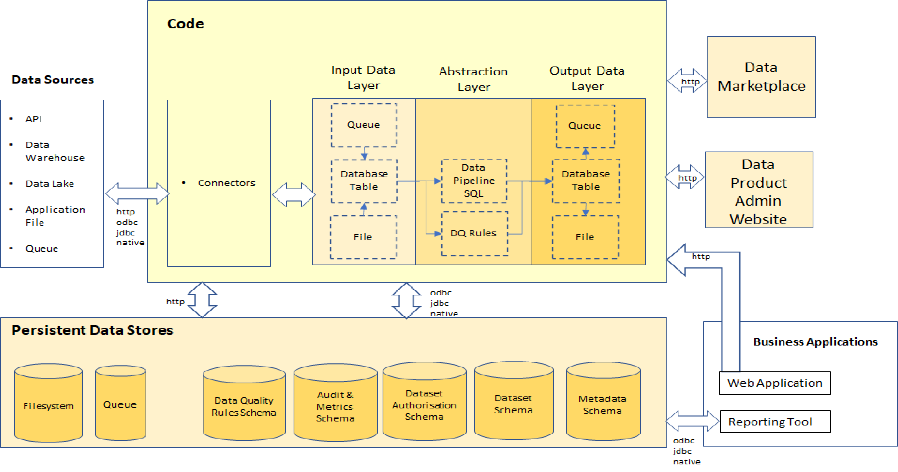
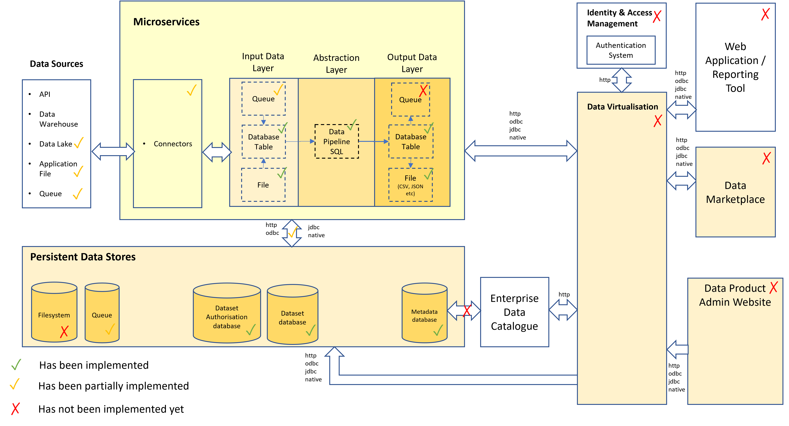

# Data Product Proof of Concept (PoC)

The aim of the PoC is to be able to deduce a viable set of architectural standards by proving that the concepts 
outlined in this Architecture Wiki are feasible in practice.

This documentation will be based initially on a data product with [REST API](https://aws.amazon.com/what-is/restful-api/) at it's core.

The REST API is particularly useful to:-
* Inject source datasets or trigger the code to pull in source datasets
* Trigger the data pipeline SQL
* Containerise the code

Other methods are possible, however.

The choice of a REST API does not affect the way that target datasets are consumed. 
The PoC will demonstrate that data & metadata can also be retrieved securely from a relational database and a queue

# Data Product PoC System Architecture

For the PoC, we can simplify what needs to be done in production by providing the following:-

1. The ports can be built out as REST API endpoints, database or queue connections 
2. The data pipeline that moves data between the layers can just be executed as sql statements. 
We will demonstrate the ability to POST transformation sql so that new datasets can be created dynamically. 
3. We will upload countries and continents files via the input data port and load these into relational tables
4. We will also stream countries and continents data into a queue in the input data layer.
7. The metadata that can be retrieved via the discovery port will be stored in a relational database so can also be accessed via standard SQL queries
8. A dataset authorisation database will link users to roles and roles to datasets. 
These dataset authorisation permissions will be implemented as grant policies against the target datasets 
held in the dataset database, thus preventing unauthorised access by users who directly query this information.
9. To ensure consistent builds on multiple cloud platforms the code will be containerised. For the PoC, we will rely on the Azure App Service container. For local deployment, we will use Docker.

## What will be proved?

We will prove that a data product can:-
1. Be containerised and deployed to a cloud platform (Azure App Service)
2. Provide metadata & docs via an API endpoint and a relational database. Metadata can also be exported from the relational database. 
3. Provide the data pipeline sql as an output so a user knows what transformation has been applied.
4. Can accept source files in both CSV & JSON format into an input data port
5. Be triggered to pull in source datasets from an Azure Data Lake via a Databricks SQL warehouse.
6. Can accept messages into a queue via an input data port 
7. Can accept a data dictionary (aka schema) that defines the source files into an input data port
8. Can transform the source files/messages into target datasets using a pipeline.sql script injected into an input data port 
9. Can store the target datasets in a queue, file or relational database table
10. Can provide the target datasets in more than 1 format (JSON or CSV) to the output data port
11. Can be secured via:-
   * user authentication
   * data product authorisation 
   * target dataset authorisation 
12. That the target data can be securely consumed by a client application e.g Power BI or Python code.
13. That the data, metadata and pipeline and schema files can be maintained by a mockup of a data product admin website
14. That data products can be discovered via a mockup of a data marketplace.

This should be sufficient to prove the concept. 

## Out of Scope for the PoC
There are other items that are not being proved but can utilise similar techniques as demonstrated above:-
For example:- 
* Accepting a Data Quality technical rules file via a control port would work in a similar fashion to item 3 in the list above.
* Storing metrics for audit purposes is simply capturing http info in the request and saving to a relational table and making the contents available via the Control Output Port. This is similar in concept to item 6. above.

Other factors aren't being demonstrated simply because solutions for these are already known. For example, the following docs/metadata can be linked to the data product using URLs:-
* Data models in PowerDesigner 
* Data Sharing Agreements can be stored in Word docs on Sharepoint

Other factors aren't being demonstrated because they are more relevant for production than for a proof of concept e.g.
* Creating the deploy container (Kubernetes) to allow the code to be deployed to any major cloud platform cluster. 
* The API Gateway

## What tooling will be used in the PoC?

The choices made were for speed of delivery. Every organisation's delivery teams will undoubtedly have different tool choices in most cases, but it's a 
Proof of Concept, so tools can easily be swapped out so long as they provide the same functionality.

### Coding 
* Coding Language - [Python](https://www.python.org/). This will be used for:-
  * The Front end (using the [Python Flask](https://en.wikipedia.org/wiki/Flask_(web_framework)) module)
  * Back end development simply due to familiarity with this language. 
<strong>Note: Most delivery teams will have their own preference for front end work, but the PoC is just demonstrating a concept.</strong>
* Integrated Development Environment (IDE) - [PyCharm](https://www.jetbrains.com/pycharm/) will be used to allow rapid coding of a REST API
* REST/GraphQL API module - [FastAPI](https://fastapi.tiangolo.com/) chosen because it's a Python module and is a fully featured API builder
* Code Version Control Repository - [GitHub Repo](https://github.com/deytalytics/DataProductPoC)
* Local Build Container - [Docker](https://www.docker.com/products/docker-desktop/)

### Data
* Relational Database - [Azure Database for PostgreSQL](https://learn.microsoft.com/en-us/azure/postgresql/) - chosen because:-
  * It's available on Azure
  * Uses a Native rather than an ODBC driver to connect from Python so is operating system agnostic.
  * Can store relational and non-relational data

### Security
* Authentication & Authorisation - handwritten in Python, basic authentication only initially.
It is hoped that an enterprise solution for authenticating a user and obtaining an ID token that can be passed to the data product and dataset authorisation systems will be found but is not yet guaranteed.

### Infrastructure
* Locally, a Docker Container can be run like a virtual machine which is useful if there are delays in servicing access requests to the cloud platform
* Cloud Platform - [Microsoft Azure](https://portal.azure.com)
* Cloud Platform Service - [Azure App Service](https://portal.azure.com/#@ShellCorp.onmicrosoft.com/resource/subscriptions/900a266e-8e11-47e1-a8e8-ba3ccfa9f292/resourceGroups/sbox-dataproduct-dev-rg/providers/Microsoft.Web/sites/t-and-s-dp-poc/appServices)
<strong>Note: In production, a more sophisticated service solution e.g. [Azure Kubernetes Service (AKS)](https://azure.microsoft.com/en-us/products/kubernetes-service/) might be preferred.</strong>

## What data will be used in the PoC?

### Input Data
For simplicity, we will be using 2 CSV files as input:-
* Countries.csv
* Continents.csv

We will be demonstrating 2 main methods for getting these source datasets into the data product:-
   * Pull these files from an Azure Data Lake via Databricks SQL Warehouse
   * Push these files into the data product input data port using a http POST request 

### Transformation
Data pipelining sql will be uploaded via the input data port (using a http POST request) which will then fire transformation which will merge the data into a continents and countries dataset which will be saved in a relational database.

### Output Data
This abstracted dataset will then be further transformed to json and csv files which will be made available to the data consumer from the output data port 

## What docs/metadata will be available in the PoC?
The REST API will provide standard OpenAPI docs via the /docs discovery endpoint. 
The description information will also include extra [data product metadata](dp-docs_and_metadata.md)
This metadata will also be stored in a relational database so that it can be easily extracted to Collibra or non-REST API data consumers can view it.

## How will the data consumer be able to consume the data product data?
* For a web application developer, the technical demo will demonstrate how to send http POST & GET requests to the REST API endpoints to obtain back responses with data and metadata.
* For a business user, the demo will demonstrate that they can access the [docs and metadata](dp-docs_and_metadata.md) about data products from a [data marketplace](data-marketplace.md) and securely access target datasets by logging in from a web application and/or via Power BI.

# What has been completed so far?

