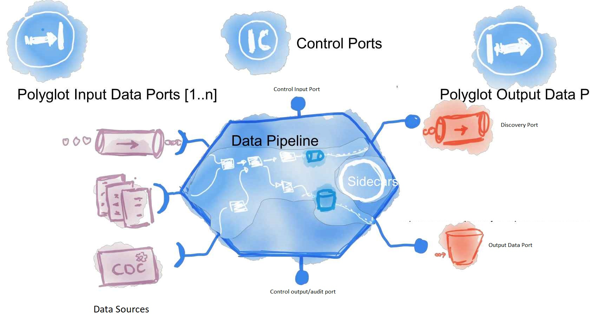

The information captured in this Wiki has been deduced by carrying out a [data product proof of concept (PoC)](dp-poc.md)

# Introduction
This website documents how to practically create data products within a data mesh.

It is the instantiation of the architectural theory provided by Zhamak Dehgani in her [Data Mesh book](https://www.oreilly.com/library/view/data-mesh/9781492092384)
which is in turn based on thinking formulated with [Martin Fowler](https://martinfowler.com/articles/data-mesh-principles.html) whilst at [ThoughtWorks](https://www.thoughtworks.com/)

It will cover the following topics:- 
* [What is special about data products](dp-business-benefits.md)
* The [data mesh principles](data-mesh-principles.md) and what is a data product
* [Data product types](dp-types.md)
* [Data Mesh/Data product architecture](dp-architecture.md)
   * [Data product & dataset creation architecture](data-product-and-dataset-creation.md)
   * [Dataset population architecure ](dataset-population.md)
   * [Dataset consumption architecture](dataset-consumption.md)
* The [data product admin website](dp-admin-website.md)
* The [data marketplace](data-marketplace.md)
* [Data Virtualisation](data-virtualisation.md)
* The creation of [data stores](dp-datastores.md) to store data captured from:-
   * Source to an Input Data Port/endpoint
   * Transformed into an abstraction layer
   * Formatted and sent via an Output Data Port/endpoint
* [The Enterprise Data Catalogue](enterprise-data-catalogue.md)
* [Required documentation & metadata](dp-docs_and_metadata.md)
* The creation of the [discovery endpoint](dp-discovery-endpoint.md) which will allow information about the REST API to be discovered 
   i.e. human & machine readable documentation & data dictionary
* The creation of [control endpoints](dp-control-endpoint.md) which will allow:-
   * Metadata and controls to be posted to a controls input port
   * Audit logs to be pulled from a controls output port
* [Improving data quality](dp-data-quality.md)
* [Authentication & authorisation](dp-authentication.md)
* How to [deploy to a cloud platform](cloud-platform-deployment.md)
* [Data product naming and versioning standards](dp-standards.md)
   * [Dataset naming and versioning standards](ds-standards.md)
* [Improving Performance](dp-performance.md)
* [Capturing metrics and auditing](dp-audit-and-metrics.md)
* Creation of data models in a [data modelling tool](data-modeling-tool.md)
* How to create and where to store data lineage diagrams
* [Infrastructure](dp-infrastructure.md)

[james.m.dey](mailto://james.dey@hotmail.com) February 2023